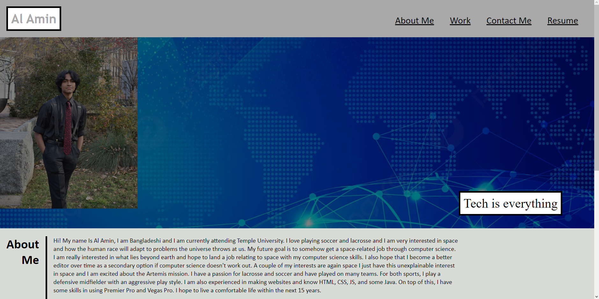

# <Horiseon>

## Description

    I was tasked to make a portfolio using a webpage. This would contain projects I worked on, about me, my resume, and contact information.

## Installation
    Firstly, I created a GitHub repo, next, I opened up my git bash and added all of the files that I needed. When I started going into the coding part I used challenge one's code for the skeleton of my project. Afterward, I added CSS coding to make the page look clean. Lastly, I updated the live page.

## Usage

The Purpose of the website was to give employers a website made to be a portfolio. Doing this gives employers an easier time collecting information and for me to have all my information already organized.

## Credits

w3schools
Challenge 1
Xpert Learning Assistant 

## Website 
[https://unevailable.github.io/Professional-Portfolio/Links](https://unevailable.github.io/Professional-Portfolio/)

## License

MIT License

Copyright (c) 2023 Unevailable

Permission is hereby granted, free of charge, to any person obtaining a copy
of this software and associated documentation files (the "Software"), to deal
in the Software without restriction, including without limitation the rights
to use, copy, modify, merge, publish, distribute, sublicense, and/or sell
copies of the Software, and to permit persons to whom the Software is
furnished to do so, subject to the following conditions:

The above copyright notice and this permission notice shall be included in all
copies or substantial portions of the Software.

THE SOFTWARE IS PROVIDED "AS IS", WITHOUT WARRANTY OF ANY KIND, EXPRESS OR
IMPLIED, INCLUDING BUT NOT LIMITED TO THE WARRANTIES OF MERCHANTABILITY,
FITNESS FOR A PARTICULAR PURPOSE AND NONINFRINGEMENT. IN NO EVENT SHALL THE
AUTHORS OR COPYRIGHT HOLDERS BE LIABLE FOR ANY CLAIM, DAMAGES OR OTHER
LIABILITY, WHETHER IN AN ACTION OF CONTRACT, TORT OR OTHERWISE, ARISING FROM,
OUT OF OR IN CONNECTION WITH THE SOFTWARE OR THE USE OR OTHER DEALINGS IN THE
SOFTWARE.
